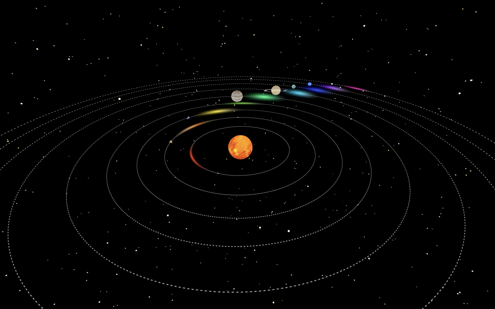

# 3D Solar System Model

Controls for navigating the simulation (Similar to Minecraft Creative Mode):  
WASD or Arrow keys: move forward, backward, sideways Spacebar: move up  
Left Shift: move down  
Mouse: look around  
Escape: close the game

This project allows you to navigate through a simple model of our solar system. Each of the planets (including Pluto) follows an elliptical orbit around the sun based on real-life
measurements of their orbits' eccentricities. Each planet's axis of rotation is tilted to reflect their real-life axial tilts. Earths moon also orbits the Earth and rotates on its
own axis. Sizes, distances, and linear and angular speeds are not to scale.
